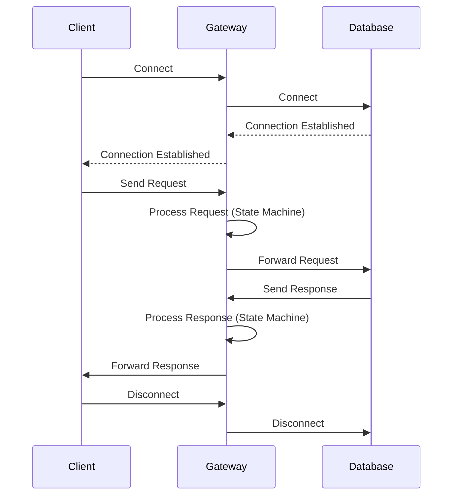

# Architecture

This document provides an overview of the architecture of the `netty-dbgw` project.

## Project Structure

The project is a multi-module Gradle project written in Kotlin. It is structured as follows:

*   **`app`**: The main application module. It is responsible for parsing command-line arguments, loading the configuration, and starting the gateway.
*   **`common`**: A module for common code that is shared between other modules.
*   **`core`**: The core module of the application. It provides the main functionality of the gateway, including the `AbstractGateway` class, the `ProxyConnectionHandler`, and the state machine.
*   **`policy`**: A module for the policy framework. It defines the interfaces and data classes for creating and evaluating policies.
*   **`policy-builtin`**: A module for built-in policies. It provides a set of ready-to-use policies that can be configured and used by the gateway.
*   **`protocols:mysql`**: A module for the MySQL protocol. It provides the implementation of the `MySqlGateway` class and the handlers for the MySQL protocol.
*   **`protocols:postgres`**: A module for the PostgreSQL protocol. It provides the implementation of the `PostgresGateway` class and the handlers for the PostgreSQL protocol.
*   **`test`**: A module for testing. It contains unit tests and integration tests for the other modules.

## High-Level Architecture

The gateway is built on top of the Netty framework, which is a high-performance, asynchronous, and event-driven network application framework. The core of the gateway is the `AbstractGateway` class, which provides the basic functionality for listening for client connections and forwarding them to an upstream database.

The `AbstractGateway` class is an abstract class that must be extended by a protocol-specific gateway class, such as `MySqlGateway` or `PostgresGateway`. The protocol-specific gateway class is responsible for providing the handlers for the specific protocol.

### ProxyConnectionHandler

The `ProxyConnectionHandler` is the first handler in the pipeline. It is responsible for:

1.  **Connecting to the backend:** It creates a new connection to the upstream database.
2.  **Setting up the pipelines:** It adds the protocol-specific handlers to the pipelines of both the frontend (client) and backend (database) connections.
3.  **Establishing the session:** It creates a new session and sets the session attributes.

### State Machine

The state machine is a key component of the gateway. It is responsible for processing messages from the client and the database and for transitioning between states. The state machine is implemented as a set of `GatewayState` classes, where each class represents a state in the protocol.

The `StateMachine` class is responsible for:

1.  **Processing messages:** It receives messages from the `StateMachineHandler` and delegates them to the current state.
2.  **Transitioning between states:** It transitions to the next state based on the result of the message processing.
3.  **Executing interceptors:** It executes the message interceptors before processing the message.

The state machine is executed in a separate thread pool to avoid blocking the Netty I/O threads.

## Main Flow Diagram

The following diagram illustrates the main data flow of the application:

## Pros and Cons

### Pros

*   **Modular Architecture:** The project is well-structured into modules with clear responsibilities. This makes it easier to understand, maintain, and extend the codebase.
*   **Extensible Protocol Support:** The use of an `AbstractGateway` and protocol-specific modules makes it easy to add support for new database protocols.
*   **State Machine for Protocol Logic:** The use of a state machine to manage the protocol logic makes the code more organized and easier to follow.
*   **Policy Framework:** The policy framework provides a flexible way to add and configure security policies.
*   **Asynchronous and Non-blocking:** The use of Netty makes the application asynchronous and non-blocking, which allows it to handle a large number of concurrent connections with high performance.

### Cons

*   **Limited Protocol Support:** Currently, only MySQL and PostgreSQL are supported. Adding support for other databases would require implementing the entire protocol from scratch.
*   **Limited Error Handling:** The error handling is basic and could be improved to provide more informative error messages.
*   **Testing:** While there are some tests, the test coverage could be improved, especially for the protocol-specific logic.

## Technical Debt

*   **TODOs in the code:** There are several `TODO` comments in the code that indicate areas that need improvement or further implementation.
*   **Hardcoded values:** There are some hardcoded values in the code that could be moved to configuration files.
*   **Lack of connection pooling:** The gateway creates a new connection to the upstream database for each client connection.
*   **Limited observability:** The application has basic logging, but it could be improved by adding more metrics and tracing.
*   **Redundant code:** There is some code duplication between the `MySqlGateway` and `PostgresGateway` classes.
*   **Potential for resource leaks:** The code for closing connections and releasing resources could be improved.
